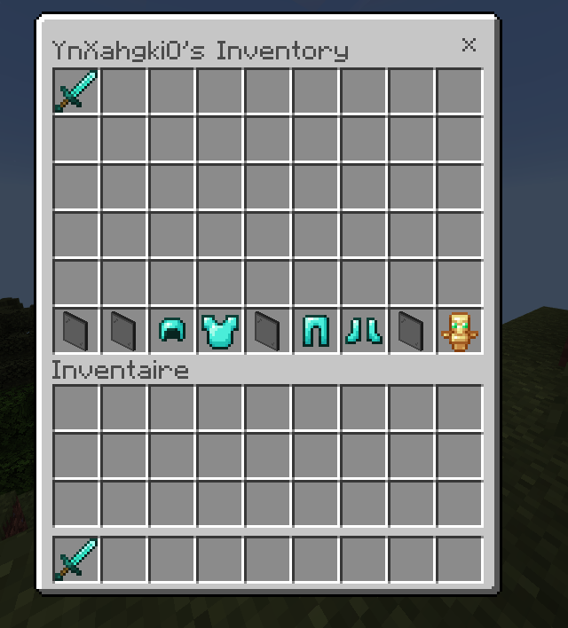

# InvSee-PNX

InvSee-PNX lets you view and modify any player's inventory and ender chest in real-time on PowerNukkitX.
Works with both online and offline players.

Requires [InvMenuPNX](https://github.com/YnXahgkiO/InvMenuPNX). Grab a compiled jar from [Releases](https://github.com/YnXahgkiO/InvSee-PNX/releases).

## Usage

### Accessing a player's inventory

Use `/invsee <player>` to open a player's inventory. A double chest menu opens with the first 36 slots showing the player's inventory in order. The bottom row displays the armor slots and offhand slot, separated by labeled glass panes.

### Accessing a player's ender chest

Use `/enderinvsee <player>` to open the player's ender chest.

### Online players

Changes made through the menu are instantly applied to the target player's inventory. Changes the target player makes to their own inventory are instantly reflected in the menu.

### Offline players

Changes are accumulated in the menu and written back to the player's save file when the last viewer closes the menu.

## Permissions

| Permission | Description | Default |
|---|---|---|
| `invsee.inventory.view` | View other players' inventories | `op` |
| `invsee.inventory.modify` | Modify other players' inventories | `op` |
| `invsee.enderinventory.view` | View other players' ender chests | `op` |
| `invsee.enderinventory.modify` | Modify other players' ender chests | `op` |
